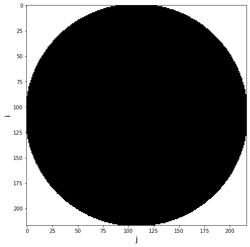
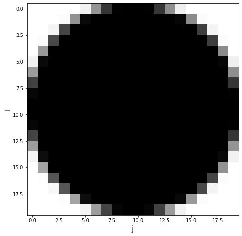
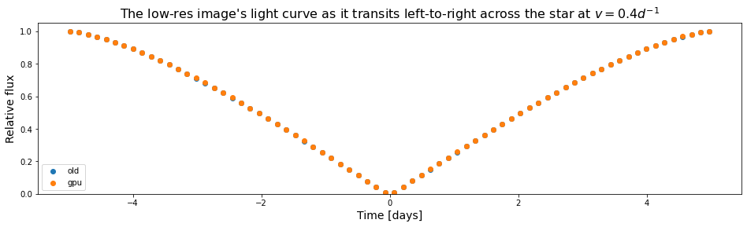

```python
import numpy as np
import matplotlib.pyplot as plt

from matplotlib import gridspec
import copy
import sys
sys.path.append("../EightBitTransit")
from EightBitTransit.inversion import *
from EightBitTr
from EightBitTransit.cTransitingImage import TransitingImage as TIoldansit.misc import *
from scipy.optimize import lsq_linear

%matplotlib inline
%load_ext autoreload
%autoreload 2
```

# Timing Differences


```python
# Option 1: Read in an image file.

# an array of times, in days, over which to calculate the light curve 
times = np.linspace(-35.,35.,500)

# create a TransitingImage object, which reads in an image file and converts it into a matrix of pixels
# transiting the star at velocity v [days**-1], with reference time t_ref [days]
SItitle = TIold(imfile="./circle.png",
                          v=0.4,
                          t_ref=0.,
                          t_arr=times)
SItitle.plot_grid()
print(np.shape(SItitle.opacitymat)) # the pixelated image grid. Notice that this is very high-resolution, so the 
                                   # light curve calculation in the next cell would be slow.

# We can speed up the light curve calculation by specifying a lower image resolution, e.g. 20 pixels in height.
# The image aspect ratio will not change.
lowres_SItitle = TIold(imfile="./circle.png",
                                 lowres=20,
                                 lowrestype="mean", # Calculate the lower-resolution version of the image by averaging "neighborhoods" of pixels in the high-res image.
                                 lowresround=False, # Let the resulting low-res pixel values take on intermediate values between 0 and 1, i.e. don't round them to 0 or 1.
                                 v=0.4,
                                 t_ref=0.,
                                 t_arr=times)
#SItitle.plot_grid() 
lowres_SItitle.plot_grid()
#print(np.shape(SItitle.opacitymat))
print(np.shape(lowres_SItitle.opacitymat))
```


    

    


    (217, 217)


    

    


    (20, 20)


```python
lowres_SItitle = TInew(imfile="./circle.png",
                                 lowres=20,
                                 lowrestype="mean", # Calculate the lower-resolution version of the image by averaging "neighborhoods" of pixels in the high-res image.
                                 lowresround=False, # Let the resulting low-res pixel values take on intermediate values between 0 and 1, i.e. don't round them to 0 or 1.
                                 v=0.4,
                                 t_ref=0.,
                                 t_arr=times)
%timeit new_LC, new_times = lowres_SItitle.gen_LC(t_arr=times) 
```

    2.47 ms ± 96.4 µs per loop (mean ± std. dev. of 7 runs, 100 loops each)


```python
lowres_SItitle = TIold(imfile="./circle.png",
                                 lowres=20,
                                 lowrestype="mean", # Calculate the lower-resolution version of the image by averaging "neighborhoods" of pixels in the high-res image.
                                 lowresround=False, # Let the resulting low-res pixel values take on intermediate values between 0 and 1, i.e. don't round them to 0 or 1.
                                 v=0.4,
                                 t_ref=0.,
                                 t_arr=times)
%timeit old_LC, old_times = lowres_SItitle.gen_LC(t_arr=times) 
```

    /opt/conda/envs/spocc/lib/python3.6/site-packages/ipykernel_launcher.py:1: DeprecationWarning: elementwise comparison failed; this will raise an error in the future.
      """Entry point for launching an IPython kernel.


    26.9 ms ± 351 µs per loop (mean ± std. dev. of 7 runs, 10 loops each)


```python
SItitle = TInew(imfile="./circle.png",
                          v=0.4,
                          t_ref=0.,
                          t_arr=times)
%timeit new_LC, new_times = SItitle.gen_LC(t_arr=times)
```

    185 ms ± 3.09 ms per loop (mean ± std. dev. of 7 runs, 1 loop each)


```python
SItitle = TIold(imfile="./circle.png",
                          v=0.4,
                          t_ref=0.,
                          t_arr=times)
%timeit new_LC, new_times = SItitle.gen_LC(t_arr=times) 
```

    /opt/conda/envs/spocc/lib/python3.6/site-packages/ipykernel_launcher.py:1: DeprecationWarning: elementwise comparison failed; this will raise an error in the future.
      """Entry point for launching an IPython kernel.


    2.46 s ± 27.7 ms per loop (mean ± std. dev. of 7 runs, 1 loop each)


# Checking consistency

## Low Res


```python
lowres_SItitle = TIold(imfile="./circle.png",
                                 lowres=20,
                                 lowrestype="mean", # Calculate the lower-resolution version of the image by averaging "neighborhoods" of pixels in the high-res image.
                                 lowresround=False, # Let the resulting low-res pixel values take on intermediate values between 0 and 1, i.e. don't round them to 0 or 1.
                                 v=0.4,
                                 t_ref=0.,
                                 t_arr=times)
# Calculate the light curve for this object. This function returns two arrays:
#    overlapTimes = the time steps at which the image grid has nonzero overlap with the star, given your choice of times and v;
#    SItitle_LC = array of relative fluxes at those time steps
old_LC, old_times = lowres_SItitle.gen_LC(t_arr=times) 

lowres_SItitle = TInew(imfile="./circle.png",
                                 lowres=20,
                                 lowrestype="mean", # Calculate the lower-resolution version of the image by averaging "neighborhoods" of pixels in the high-res image.
                                 lowresround=False, # Let the resulting low-res pixel values take on intermediate values between 0 and 1, i.e. don't round them to 0 or 1.
                                 v=0.4,
                                 t_ref=0.,
                                 t_arr=times)
# Calculate the light curve for this object. This function returns two arrays:
#    overlapTimes = the time steps at which the image grid has nonzero overlap with the star, given your choice of times and v;
#    SItitle_LC = array of relative fluxes at those time steps
new_LC, new_times = lowres_SItitle.gen_LC(t_arr=times) 
```

    /opt/conda/envs/spocc/lib/python3.6/site-packages/ipykernel_launcher.py:11: DeprecationWarning: elementwise comparison failed; this will raise an error in the future.
      # This is added back by InteractiveShellApp.init_path()


```python
fig, ax = plt.subplots(1,1,figsize=(16,4))
ax.scatter(old_times,old_LC, label="old")
ax.scatter(new_times,new_LC, label="gpu")
ax.set_ylim(0.0,1.05)
plt.xlabel("Time [days]",fontsize=14)
plt.ylabel("Relative flux",fontsize=14)
plt.title(r"The low-res image's light curve as it transits left-to-right across the star at $v = 0.4 d^{-1}$",fontsize=16)
plt.legend()
plt.show()
```


    

    


```python
np.mean(new_LC-old_LC)
```


    0.0037954067192858976


```python
np.std(new_LC-old_LC)
```


    0.003797796398818424


## High res


```python
SItitle = TInew(imfile="./circle.png",
                          v=0.4,
                          t_ref=0.,
                          t_arr=times)
new_LC, new_times = SItitle.gen_LC(t_arr=times)
SItitle = TIold(imfile="./circle.png",
                          v=0.4,
                          t_ref=0.,
                          t_arr=times)
old_LC, old_times = SItitle.gen_LC(t_arr=times) 
```

    /opt/conda/envs/spocc/lib/python3.6/site-packages/ipykernel_launcher.py:10: DeprecationWarning: elementwise comparison failed; this will raise an error in the future.
      # Remove the CWD from sys.path while we load stuff.


```python
fig, ax = plt.subplots(1,1,figsize=(16,4))
ax.scatter(old_times,old_LC, label="old")
ax.scatter(new_times,new_LC, label="gpu")
ax.set_ylim(0.0,1.05)
plt.xlabel("Time [days]",fontsize=14)
plt.ylabel("Relative flux",fontsize=14)
plt.title(r"The low-res image's light curve as it transits left-to-right across the star at $v = 0.4 d^{-1}$",fontsize=16)
plt.legend()
plt.show()
```


    

    


```python
np.mean(new_LC-old_LC)
```


    0.000371766971393489


```python
np.std(new_LC-old_LC)
```


    0.00016586238041238905


